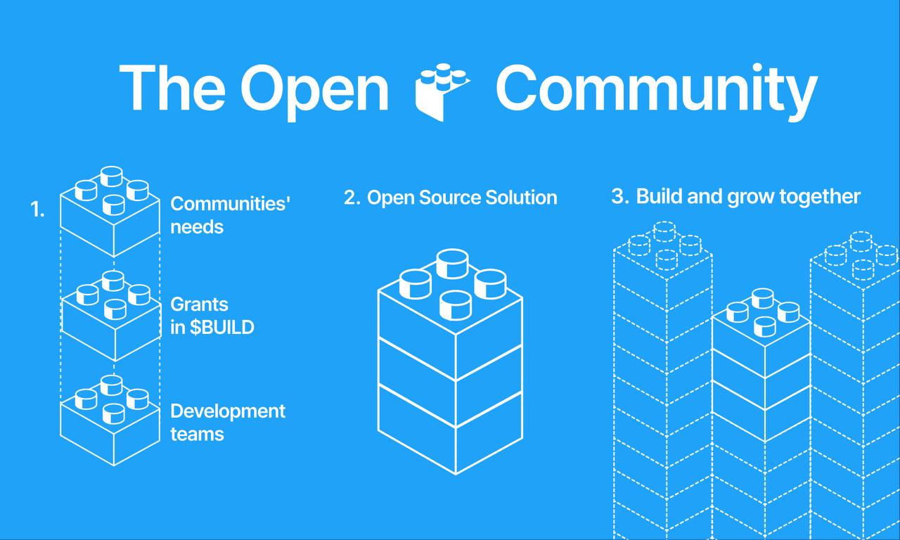

# Open Builders

**The gateway to The Open Network**

We build open source tools for Telegram communities: Features for chats and channels, community management, tools for crypto and collectibles within Telegram. All tools are built by independent developers. Follow our [announcements](t.me/builders) so you don't miss the next developer contest.

## Our Tools

| Tool | Description | Status |
|------|------------|--------|
| [Access](https://github.com/OpenBuilders/access-tool) | Custom access rules for private groups and channels | Live |
| [Contest](https://github.com/OpenBuilders/contest-app) | Create, host, and join contests on Telegram | Live |
| [Giveaway](https://github.com/OpenBuilders/giveaway-tool-backend) | Run giveaways in your Telegram community | Live |
| [UI Kit](https://github.com/OpenBuilders/ui-kit-public) | Shared component library for TG Tools | Active |
| Ad Marketplace | Marketplace that connects channel owners and advertisers | In progress |

## Contribute

We welcome contributions from developers of all levels. Our tools are built by independent developers supported by [$BUILD](https://dyor.io/ru/token/build) [grants](https://t.me/builders/264).

- Browse [`good first issue`](https://github.com/search?q=org%3AOpenBuilders+label%3A%22good+first+issue%22+is%3Aopen&type=issues) to get started
- Read our [Contributing Guide](https://github.com/OpenBuilders/.github/blob/main/CONTRIBUTING.md)
- Issues with the `bounty` label carry a $BUILD reward

## Community

- [Telegram Chat](https://t.me/tools_community) — discuss, ask questions, collaborate
- [Telegram Channel](https://t.me/builders) — updates and announcements
- [Website](https://openbuilders.xyz)
- [Twitter/X](https://x.com/open_builders)
